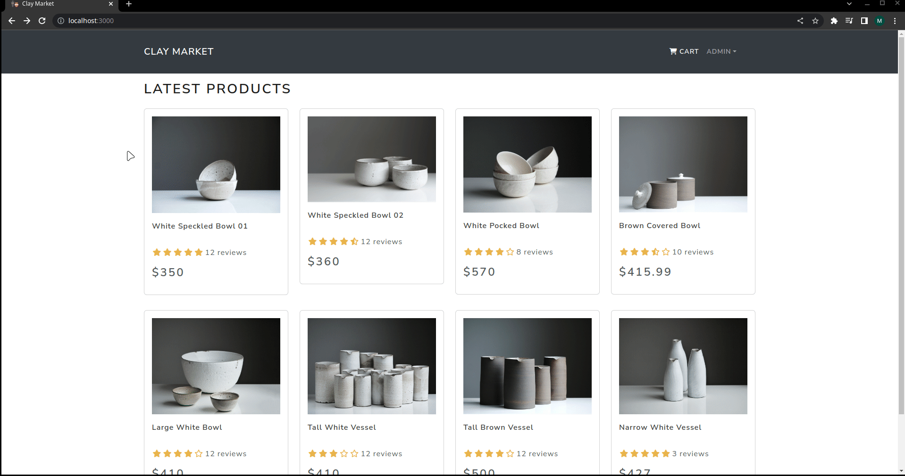

# Clay Market
Clay Market is a full-stack app created to serve as a consolidated marketplace where select potters throughout Southern Virginia can easily sell their works at prices they set without having to deal with listing fees, transaction fees, promotional ads, or other hindrances.

**The app is currently being developed and is not fully operational yet.** Listed products are for example's sake only. Payment processing isn't *fully* integrated just yet, so if you download this code and toy around with it, don't worry about accidentally purchasing something.

**Link to project:** *Coming soon!*
## How It's Made:

**Tech used:** HTML, CSS, JavaScript, React, Redux, create-react-app, react-bootstrap, Express, MongoDB

The front end is created with `React`, and `Redux` is used to manage state. As of now, `React Bootstrap` is used so that I can quickly style the site, but I'll most likely refactor it to use pure CSS after the front and back ends are fully architected.
The back end uses `Express` as the foundation for the server, `jsonwebtoken` for encrypting user data, and `MongoDB` + `Mongoose` for storing user, product, and order data.
`bcrypt` is used to hash/salt user passwords before being stored in the database.

The following libraries aren't prudent to the functionality of the app, but I'm listing them should you choose to recreate the app or in case you're curious:
`colors` - Allows you to programatically color console logs on the server.
`morgan` - Gives you basic logging for HTTP requests
`concurrently` - Gives you the ability to run multiple commands concurrently (hehe) in one terminal. (e.g. run the back end and front end in one terminal with one script)

## Lessons Learned:
***WHEW,*** where do I start? I'm learning new stuff every day as I work on this. 

My biggest takeaway so far is I never knew how convoluted Redux could get. 

This is also my first time using JWTs, so I got to learn a bit about them. In the past, I just used stored session data in a database to protect routes behind auth.
 
I'll be sure to make an actual concrete list of things I've learned along the way when I've finished the project, but for now I just wanted to jot some thoughts down to help decompress after working on this and another project for ~14 hours a day, 5 days straight. (Not healthy! Don't do this!)

